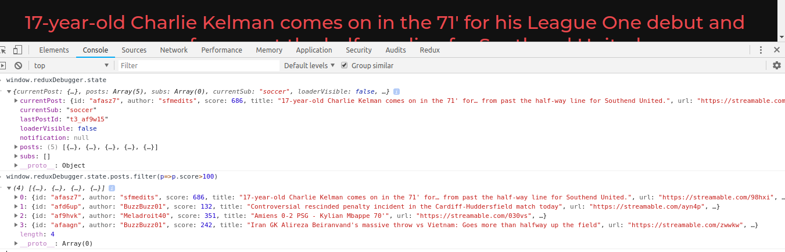
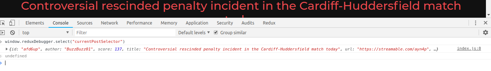

Redux Debugger is a simple Redux middleware that enables you to query your redux state or debug your selectors through the browsers devtools.

Devtools of major browsers like Google Chrome and Mozilla Firefox are fairly powerful scripting environments with support for easy inspection of objects and even autocomplete.

# Install

```
npm i --save redux-debugger
```

# How to use

Adding the middleware

```
import { reduxDebugMiddleware } from "redux-debugger";

// along with other middlewares
applyMiddleware(reduxDebugMiddleware)

```

Thats it, now open the Console window of your favourite browser devtools and you can query your state like -



### Configuring Selectors

If you use selectors to derive data from your state, you can call them from the devtools as well.

```
import { registerSelectors } from "redux-debugger";

const currentPostSelector = state => {
  return state.currentPost;
};

const postListSelector = state => {
    return state.posts;
}

registerSelectors({
    currentPostSelector,
    postListSelector
});

```

You can call selectors using the `select` function in the `reduxDebugger` object.



# LICENSE

The MIT License (MIT)

Copyright (c) 2019 Anirudh Varma

Permission is hereby granted, free of charge, to any person obtaining a copy of this software and associated documentation files (the "Software"), to deal in the Software without restriction, including without limitation the rights to use, copy, modify, merge, publish, distribute, sublicense, and/or sell copies of the Software, and to permit persons to whom the Software is furnished to do so, subject to the following conditions:

The above copyright notice and this permission notice shall be included in all copies or substantial portions of the Software.

THE SOFTWARE IS PROVIDED "AS IS", WITHOUT WARRANTY OF ANY KIND, EXPRESS OR IMPLIED, INCLUDING BUT NOT LIMITED TO THE WARRANTIES OF MERCHANTABILITY, FITNESS FOR A PARTICULAR PURPOSE AND NONINFRINGEMENT. IN NO EVENT SHALL THE AUTHORS OR COPYRIGHT HOLDERS BE LIABLE FOR ANY CLAIM, DAMAGES OR OTHER LIABILITY, WHETHER IN AN ACTION OF CONTRACT, TORT OR OTHERWISE, ARISING FROM, OUT OF OR IN CONNECTION WITH THE SOFTWARE OR THE USE OR OTHER DEALINGS IN THE SOFTWARE.
